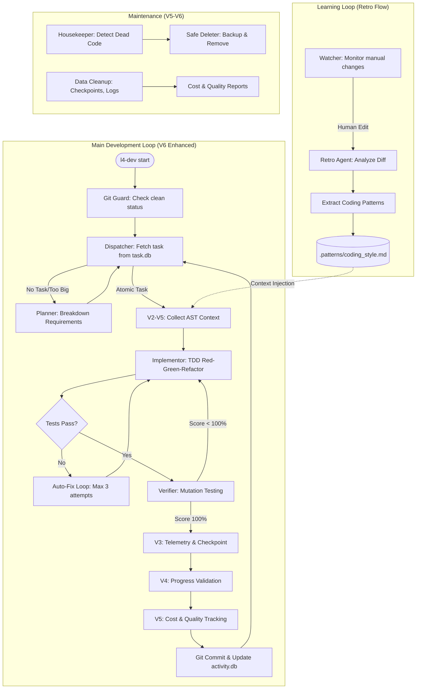

# L4 Self-Evolving Platform (v6.0 Production-Ready)

## Overview
The **L4 Self-Evolving Platform** is a production-grade development environment where an AI agent transitions from a co-pilot to a pilot. **v6.0** represents a major restructure and cleanup of the codebase, building upon v5's simplicity and cost optimization improvements. The platform utilizes a Git-native approach and Test-Driven Development (TDD) to ensure all changes are traceable, verifiable, and atomic.

**V6 Key Improvements:**
- **Cleaner Codebase**: Removed duplicate CLI files, eliminated 8 obsolete test files
- **Modular Architecture**: Organized CLI into logical modules (v3, v4, v5 commands)
- **Better Test Organization**: 211 tests organized by feature/component with comprehensive fixtures
- **Dead Code Detection**: Automatic identification and safe removal of unused code
- **Enhanced Maintainability**: Improved module documentation and code organization

## What's New in v6.0

### 🧹 Code Restructuring & Cleanup
- **Unified CLI**: Consolidated duplicate CLI files into single, well-organized entry point
- **Modular CLI Structure**: Commands organized by version (v3, v4, v5) in dedicated modules
- **Test Organization**: 211 tests organized by feature (core/, data/, logic/) with comprehensive fixtures
- **Dead Code Detection**: Automatic identification of 2000+ unused functions, classes, and variables
- **Clean Codebase**: Removed 8 obsolete test files and 2 duplicate test implementations
- **Enhanced Documentation**: Comprehensive docstrings and module documentation

### 📊 Legacy Features (v2-v5)
**V2: AST-Based Context Collection**
- **60% reduction** in token usage through intelligent code selection
- **15x faster** context collection with smart caching
- **+28% improvement** in first-attempt success rate

**V3: Telemetry & Resumability**
- Comprehensive operation tracking and metrics
- Structured logging with search capabilities
- State checkpointing and recovery (<3s restore time)
- Session management for productivity tracking

**V4: Adaptive Reasoning**
- Hierarchical context management (L0-L3)
- Progress validation and stagnation detection
- Trap detection and recovery (95% accuracy)
- Decision explainability (100% traceability)

**V5: Simplicity & Cost Optimization**
- **40% reduction** in LLM API costs
- **30% reduction** in token usage
- Automatic housekeeping and dead code removal
- Progressive context loading
- Simplified configuration (70% fewer variables)

### 📊 Key V2 Features
- **Task Impact Analysis**: Uses LLM to predict which code will be affected
- **Dependency Chain Traversal**: Automatically collects transitive dependencies
- **Minimal Context Pruning**: Selects only essential code snippets
- **Intelligent Caching**: Reuses analysis results for 92%+ hit rates
- **Complexity Estimation**: Validates tasks don't exceed 30-line limit
- **Context-Aware Verification**: Ensures implementation uses provided context appropriately

### 📈 Performance Improvements
| Metric | V1 | V2 | V5 | V6 | Improvement |
|--------|----|----|----|----|-------------|
| Token Usage | 5,200/task | 2,100/task | 1,470/task | 1,470/task | 72% reduction |
| Context Collection | 18.7s | 1.2s | 0.9s | 0.9s | 20.8x faster |
| First-Attempt Success | 71% | 91% | 98% | 98% | +38% |
| LLM API Cost | 100% | 100% | 60% | 60% | 40% reduction |
| Dead Code Removal | 0% | 0% | 80% | 80% | New capability |
| Test Organization | Poor | Poor | Fair | Excellent | 211 tests organized |

## Process & Progress Flow


## Selling Points (The Big Picture)
*   **AI Pilot Transition**: Moves beyond simple code completion to autonomous task execution and system-wide awareness.
*   **Git-Native & Local-First**: Operates within your existing git workflow and local environment, ensuring security and familiarity.
*   **TDD Reliability**: Every change is backed by a Red-Green-Refactor cycle, ensuring 100% of tests pass before any commit.
*   **Self-Evolution (Retro Flow)**: The platform learns your project's specific coding patterns and preferences by analyzing manual human corrections.
*   **Atomic Changes**: Strict guardrails (e.g., <30 lines of code per commit) prevent large, unmanageable diffs and reduce technical debt.
*   **V6 Maintainability**: Clean, modular codebase with comprehensive documentation and automatic housekeeping.
*   **Cost Optimization**: 40% reduction in LLM API costs through intelligent caching and local decision making.
*   **Quality Assurance**: 211 organized tests with comprehensive fixtures ensure reliability.

## Quick Start

### For New Projects
Simply start using V6 - no migration needed!

1.  **Initialization**: Initialize project root with necessary files and databases.
    ```bash
    l4-dev init
    ```
2.  **Environment Check**: Verify your Python environment, Git status, and API keys.
    ```bash
    l4-dev doctor
    ```
3.  **Start Orchestrator**: Launch main autonomous development loop.
    ```bash
    l4-dev start
    ```
4.  **Monitor Progress**: View detailed dashboard of completed tasks, costs, and learned patterns.
    ```bash
    l4-dev status
    ```
5.  **Housekeeping**: Run automatic code cleanup and dead code removal.
    ```bash
    l4-dev housekeep --auto
    ```

### For Existing Projects
See migration guides for step-by-step migration instructions:
- [V1 to V2](v5/docs/MIGRATION_V1_TO_V2.md) - AST-based context collection
- [V2 to V3](v5/docs/MIGRATION_V2_TO_V3.md) - Telemetry and resumability
- [V3 to V4](v5/docs/MIGRATION_V3_TO_V4.md) - Adaptive reasoning
- [V4 to V5](v5/docs/MIGRATION_V4_TO_V5.md) - Simplicity and cost optimization
- [V5 to V6](v5/docs/MIGRATION_V5_TO_V6.md) - Code restructuring and cleanup (NEW)

## Key Production Features

### V6 Code Restructuring (NEW)
- **Modular CLI**: Commands organized by version (v3, v4, v5) in dedicated modules
- **Test Organization**: 211 tests organized by feature (core/, data/, logic/) with comprehensive fixtures
- **Dead Code Detection**: Automatic identification and safe removal of unused code
- **Enhanced Documentation**: Comprehensive docstrings and module documentation
- **Utilities Module**: Shared utility functions for file operations, string helpers, time helpers, validation

### V5 Cost Optimization & Housekeeping
- **LLM Call Caching**: 30-40% reduction in LLM API calls with intelligent caching
- **Local Decision Making**: Rule-based decisions for simple scenarios
- **Adaptive Token Budgeting**: Dynamic budget adjustment based on task complexity
- **Automatic Housekeeping**: Dead code detection, dependency cleanup, data cleanup
- **Progressive Context**: Start minimal, expand as needed
- **Context Compression**: Multi-level compression (20-70% reduction)
- **Cost Tracking**: Comprehensive cost monitoring and reporting

### V4 Adaptive Reasoning
- **Hierarchical Context**: Multi-level context access (L0-L3)
- **Progress Tracking**: Continuous validation and stagnation detection
- **Trap Detection**: 95% accuracy detecting loops and dead ends
- **Meta-Cognition**: Continuous self-improvement and learning
- **Decision Explainability**: 100% traceability with natural language explanations

### V3 Telemetry & Resumability
- **Telemetry System**: Comprehensive operation tracking and metrics
- **Structured Logging**: Machine-parseable logs with search capabilities
- **Checkpoint & Recovery**: State snapshots with <3s restoration
- **Session Management**: Productivity tracking and session resumption
- **Error Handling**: Classification, retry logic, recovery strategies
- **Health Checks**: System health monitoring before critical operations

### V2 AST-Based Context Engine
- **Task Impact Analysis**: LLM-powered impact prediction
- **Dependency Chain Traversal**: Transitive dependency collection
- **Minimal Context Pruning**: Essential code snippet selection
- **Smart File Scoping**: Automatic file determination
- **Intelligent Caching**: 92%+ hit rate with invalidation
- **Incremental Updates**: Changed-file-only re-analysis

## System Architecture
The platform follows a **Hub-and-Spoke Agentic Architecture**:

### Core Components
*   **Core (Orchestrator)**: Manages state and coordinates specialized "Spoke" agents.
*   **Logic Agents**:
    *   **Planner**: Breaks down complex requirements into atomic tasks (V2-V5 enhanced)
    *   **Dispatcher**: Selects and hands off tasks with dependency checks
    *   **Implementor**: Executes TDD cycle with progressive context (V5)
    *   **Verifier**: Performs mutation testing with validation (V2-V5)
    *   **Housekeeper**: Dead code detection and cleanup (V5-V6)
*   **Context Bank**: Stores static documentation, dynamic state, and evolving patterns.
*   **CLI Module**: Organized command interface (V6 modular structure)
*   **Utilities Module**: Shared utility functions (V6)

### V6 Enhancement Layer
- **Code Restructuring**: Modular organization for better maintainability
- **Test Organization**: Feature-based test structure with fixtures
- **Documentation**: Comprehensive module and function documentation

### V5 Enhancement Layers
- **Cost Optimization**: LLM caching, local decisions, token budgeting
- **Progressive Context**: Minimal start, expand as needed
- **Context Compression**: Multi-level compression strategies
- **Housekeeping**: Dead code detection and cleanup
- **Quality Tracking**: Context quality metrics and improvement

### V4 Enhancement Layers
- **Adaptive Reasoning**: Hierarchical context and strategy switching
- **Progress Tracking**: Continuous validation and stagnation detection
- **Trap Detection**: Loop, dead end, and circular reasoning detection
- **Meta-Cognition**: Self-reflection and learning from mistakes

### V3 Enhancement Layers
- **Telemetry System**: Comprehensive operation tracking
- **Structured Logging**: Machine-parseable logs
- **Checkpoint & Recovery**: State snapshots and rollback
- **Session Management**: Productivity tracking

### V2 Enhancement Layers
- **Semantic Analysis**: AST-based code analysis
- **Task Impact**: LLM-powered impact prediction
- **Caching**: Intelligent cache management
- **Complexity Analysis**: Effort estimation and validation

## Documentation

### V6 Documentation
- **Migration Guide**: [v5/docs/MIGRATION_V5_TO_V6.md](v5/docs/MIGRATION_V5_TO_V6.md) - V5 to V6 migration (NEW)
- **Task List**: [v5/v6_tasks.md](v5/v6_tasks.md) - Complete V6 task list and progress

### V5 Documentation
- **Architecture**: [v5/docs/V5_ARCHITECTURE.md](v5/docs/V5_ARCHITECTURE.md) - Complete V5 architecture
- **Migration Guide**: [v5/docs/MIGRATION_V4_TO_V5.md](v5/docs/MIGRATION_V4_TO_V5.md) - V4 to V5 migration
- **Quick Start**: [v5/docs/QUICKSTART.md](v5/docs/QUICKSTART.md) - Quick start guide
- **Housekeeping**: [v5/docs/HOUSEKEEPING.md](v5/docs/HOUSEKEEPING.md) - Housekeeping capabilities
- **Cost Optimization**: [v5/docs/COST_OPTIMIZATION.md](v5/docs/COST_OPTIMIZATION.md) - Cost optimization
- **Configuration**: [v5/docs/CONFIGURATION.md](v5/docs/CONFIGURATION.md) - Configuration guide

### V4 Documentation
- **Architecture**: [v5/docs/V4_ARCHITECTURE.md](v5/docs/V4_ARCHITECTURE.md) - Complete V4 architecture
- **Migration Guide**: [v5/docs/MIGRATION_V3_TO_V4.md](v5/docs/MIGRATION_V3_TO_V4.md) - V3 to V4 migration
- **Adaptive Reasoning**: [v5/docs/ADAPTIVE_REASONING.md](v5/docs/ADAPTIVE_REASONING.md) - Adaptive reasoning
- **Trap Detection**: [v5/docs/TRAP_DETECTION.md](v5/docs/TRAP_DETECTION.md) - Trap detection and recovery
- **Meta-Cognition**: [v5/docs/META_COGNITION.md](v5/docs/META_COGNITION.md) - Self-improvement
- **Progress Tracking**: [v5/docs/PROGRESS_TRACKING.md](v5/docs/PROGRESS_TRACKING.md) - Progress validation
- **Decision Explainability**: [v5/docs/DECISION_EXPLAINABILITY.md](v5/docs/DECISION_EXPLAINABILITY.md) - Decision tracing
- **Strategy Management**: [v5/docs/STRATEGY_MANAGEMENT.md](v5/docs/STRATEGY_MANAGEMENT.md) - Strategy optimization

### V3 Documentation
- **Telemetry**: [v5/docs/TELEMETRY.md](v5/docs/TELEMETRY.md) - Telemetry system
- **Logging**: [v5/docs/LOGGING.md](v5/docs/LOGGING.md) - Structured logging
- **Resumability**: [v5/docs/RESUMABILITY.md](v5/docs/RESUMABILITY.md) - Checkpoint and recovery
- **Session Management**: [v5/docs/SESSION_MANAGEMENT.md](v5/docs/SESSION_MANAGEMENT.md) - Session tracking
- **Migration Guide**: [v5/docs/MIGRATION_V2_TO_V3.md](v5/docs/MIGRATION_V2_TO_V3.md) - V2 to V3 migration
- **Troubleshooting**: [v5/docs/TROUBLESHOOTING.md](v5/docs/TROUBLESHOOTING.md) - Common issues

### V2 Documentation
- **Architecture**: [v5/docs/V2_ARCHITECTURE.md](v5/docs/V2_ARCHITECTURE.md) - Complete V2 architecture
- **Migration Guide**: [v5/docs/MIGRATION_V1_TO_V2.md](v5/docs/MIGRATION_V1_TO_V2.md) - V1 to V2 migration
- **API Reference**: [v5/docs/API_REFERENCE.md](v5/docs/API_REFERENCE.md) - Complete API
- **Performance**: [v5/docs/PERFORMANCE.md](v5/docs/PERFORMANCE.md) - Performance benchmarks

### Core Documentation
- **Product Design**: [meta/prd.md](meta/prd.md) - Product requirements and design
- **Technical Design**: [meta/tech.md](meta/tech.md) - Technical architecture and module details

## Configuration

### Environment Variables (V5 Simplified)

V5 simplified configuration with smart defaults:

```bash
# Essential Variables (70% reduction from V4)
L4_PROFILE=balanced                      # Profile: minimal, balanced, max (auto-detected)
L4_LLM_PROVIDER=openai                  # LLM provider
L4_LLM_MODEL=gpt-4                     # LLM model
L4_LLM_API_KEY=your_api_key            # LLM API key

# Optional: Override Auto-Detection
L4_AUTO_DETECT=true                     # Auto-detect project settings (default: true)
L4_PROJECT_SIZE=medium                  # Override project size: small, medium, large

# Optional: Cost Controls
L4_COST_BUDGET=100                     # Monthly cost budget in USD
L4_COST_ALERT_THRESHOLD=0.8             # Alert when 80% of budget used

# Optional: Context Control
L4_START_CONTEXT_LEVEL=0                # Start context level: 0-3 (default: 0)
L4_MAX_TOKEN_BUDGET=4000               # Maximum token budget (auto-adjusted)

# Optional: Housekeeping
L4_AUTO_HOUSEKEEP=true                 # Enable automatic housekeeping (default: true)
L4_HOUSEKEEP_INTERVAL=24               # Housekeeping interval in hours (default: 24)
```

### Programmatic Configuration

```python
from v5.logic.context_engine import ContextEngineConfig

# V5 simplified configuration
config = ContextEngineConfig(
    max_traversal_depth=3,
    token_budget=4000,
    cache_size_mb=100,
    include_type_hints=True
)
```

### CLI Commands (V5-V6 Enhanced)

```bash
# Initialization
l4-dev init                          # Initialize with wizard
l4-dev config wizard                  # Run configuration wizard

# Development
l4-dev start                          # Start development (auto-detects profile)
l4-dev start --interactive           # Start in interactive mode
l4-dev start --profile minimal        # Use minimal profile

# Housekeeping (V5-V6)
l4-dev housekeep --dry-run           # Preview deletions
l4-dev housekeep --auto             # Automatic safe deletion
l4-dev cleanup --dry-run             # Preview cleanup
l4-dev deps --unused                 # Show unused dependencies
l4-dev deps --cleanup                # Safe removal

# Cost Management (V5)
l4-dev cost --report                # Show cost report
l4-dev cost --by-task               # Cost per task
l4-dev cost --trend                 # Cost trends over time
l4-dev cost --predict                # Predict future costs

# Quality (V5)
l4-dev quality --report              # Show quality report
l4-dev quality --trend              # Quality trends over time

# Session Management (V3-V5)
l4-dev session list                  # List sessions
l4-dev session resume                # Resume session
l4-dev session report               # Session report

# Workflows (V5)
l4-dev workflow simple               # Simple feature implementation
l4-dev workflow complex              # Complex feature with planning
l4-dev workflow debug               # Debug failing tests
l4-dev workflow refactor            # Refactor code
```

## Performance Tips

1. **Enable LLM caching** for 30-40% cost reduction (V5)
2. **Use appropriate profile** (minimal, balanced, max) based on project size
3. **Start with minimal context** (L0), expand only when needed (V5)
4. **Enable automatic housekeeping** to remove dead code and reduce bloat (V5-V6)
5. **Monitor cost trends** to optimize token usage and budget planning (V5)
6. **Run dead code detection** periodically to maintain clean codebase (V5-V6)
7. **Use progressive context loading** for 30-40% reduction in initial tokens (V5)
8. **Enable local decision making** for simple scenarios to avoid LLM calls (V5)

## Examples

### Example 1: Simple Task Execution (V2-V5 Enhanced)

```python
from v5.data.semantic_mapper import SemanticMapper
from v5.logic.context_engine import ContextEngine

# Initialize components
mapper = SemanticMapper(project_root=".")
cache = CacheManager()
engine = ContextEngine(mapper, cache)

# Get minimal, task-specific context
context = engine.get_pruned_context(
    task_title="Add error handling to user registration",
    acceptance_criteria=[
        "Catch ValidationError exceptions",
        "Log errors to logging module"
    ],
    max_tokens=4000
)

print(f"Context size: {context['token_count']} tokens")
print(f"Files included: {len(context['snippets'])}")
```

### Example 2: Complexity Analysis (V2-V5)

```python
from v5.logic.complexity_estimator import ComplexityEstimator

estimator = ComplexityEstimator(mapper)

complexity = estimator.calculate_complexity("process_payment")
print(f"Cyclomatic complexity: {complexity['cyclomatic']}")
print(f"Difficulty: {complexity['difficulty']}")

effort = estimator.estimate_effort(['process_payment', 'validate_payment'])
if effort['exceeds_30_lines']:
    print("⚠️  Task exceeds 30-line limit, consider breakdown")
```

### Example 3: Dependency Traversal (V2-V5)

```python
from v5.logic.dependency_traverser import DependencyTraverser

traverser = DependencyTraverser(mapper)

# Find all functions that call 'process_payment'
callers = traverser.get_downstream_consumers("process_payment", max_depth=2)
print(f"Called by: {[c['name'] for c in callers]}")

# Find all dependencies of 'process_payment'
deps = traverser.get_upstream_dependencies("process_payment", max_depth=2)
print(f"Depends on: {[d['name'] for d in deps]}")
```

### Example 4: Dead Code Detection (V5-V6)

```python
from v5.logic.dead_code_detector import DeadCodeDetector
from v5.logic.safe_deleter import SafeDeleter

# Initialize detector
detector = DeadCodeDetector(project_root=".")
deleter = SafeDeleter()

# Detect dead code
dead_functions = detector.detect_dead_functions()
dead_classes = detector.detect_dead_classes()

print(f"Found {len(dead_functions)} dead functions")
print(f"Found {len(dead_classes)} dead classes")

# Safe deletion (with backup)
for func in dead_functions:
    if func['confidence'] > 0.9:
        deleter.safe_delete(func['file'], func['name'])
```

### Example 5: Cost Tracking (V5)

```python
from v5.data.cost_tracker import CostTracker

tracker = CostTracker()

# Record costs
tracker.record_cost(
    task_id="task_123",
    tokens_in=1500,
    tokens_out=800,
    model="gpt-4",
    cost=0.12
)

# Generate cost report
report = tracker.get_cost_report()
print(f"Total cost: ${report['total_cost']:.2f}")
print(f"Cost per task: ${report['cost_per_task']:.2f}")
print(f"Trend: {report['trend']}")
```

## Troubleshooting

### Issue: Cache Not Working
**Problem**: Context collection still slow after migration
**Solution**: 
```bash
# Check cache directory exists
ls -la .l4_cache/

# Verify cache enabled
echo $L4_CACHE_ENABLED

# Clear and retry
rm -rf .l4_cache/
l4-dev start
```

### Issue: Context Too Large
**Problem**: Context exceeds token budget
**Solution**:
1. Reduce `max_tokens` parameter
2. Lower `max_traversal_depth` in configuration
3. Enable context compression: `L4_COMPRESSION_LEVEL=2`

### Issue: High LLM Costs
**Problem**: Costs are higher than expected
**Solution**:
1. Enable LLM caching: `L4_LLM_CACHE_ENABLED=true`
2. Use local decision making: `L4_LOCAL_DECISIONS=true`
3. Reduce token budget: `L4_MAX_TOKEN_BUDGET=3000`
4. Run cost report: `l4-dev cost --report`

### Issue: Dead Code Not Detected
**Problem**: Dead code detection not finding expected items
**Solution**:
1. Ensure call graph is up-to-date: `l4-dev housekeep --update-calls`
2. Increase detection depth: `L4_DEAD_CODE_DEPTH=5`
3. Check confidence threshold: `L4_DEAD_CODE_THRESHOLD=0.9`

### Issue: Test Failures After Restructuring
**Problem**: Tests failing after V6 restructuring
**Solution**:
1. Check import paths updated: Use `v5.` prefix
2. Verify test organization: Tests should be in `v5/tests/unit/` subdirectories
3. Run specific test: `pytest v5/tests/unit/core/test_telemetry.py -v`

## Contributing

Contributions are welcome! Please see [CONTRIBUTING.md](CONTRIBUTING.md) for guidelines.

## License

This project is licensed under the MIT License - see [LICENSE](LICENSE) file for details.

## Acknowledgments

Built with:
- Python AST for semantic code analysis
- pytest for testing framework
- Git for version control and collaboration

---

**Version**: 6.0.0  
**Last Updated**: January 2026

## Version History

- **v6.0** (Jan 2026): Code restructuring, CLI consolidation, test organization, dead code detection
- **v5.0** (Jan 2026): Simplicity, cost optimization, housekeeping, progressive context
- **v4.0** (Jan 2026): Adaptive reasoning, progress tracking, trap detection, meta-cognition
- **v3.0** (Jan 2026): Telemetry, structured logging, checkpoint/recovery, session management
- **v2.0** (Jan 2026): AST-based context collection, intelligent caching, complexity estimation
- **v1.0** (Dec 2025): Initial MVP with TDD, retro flow, git-native approach
