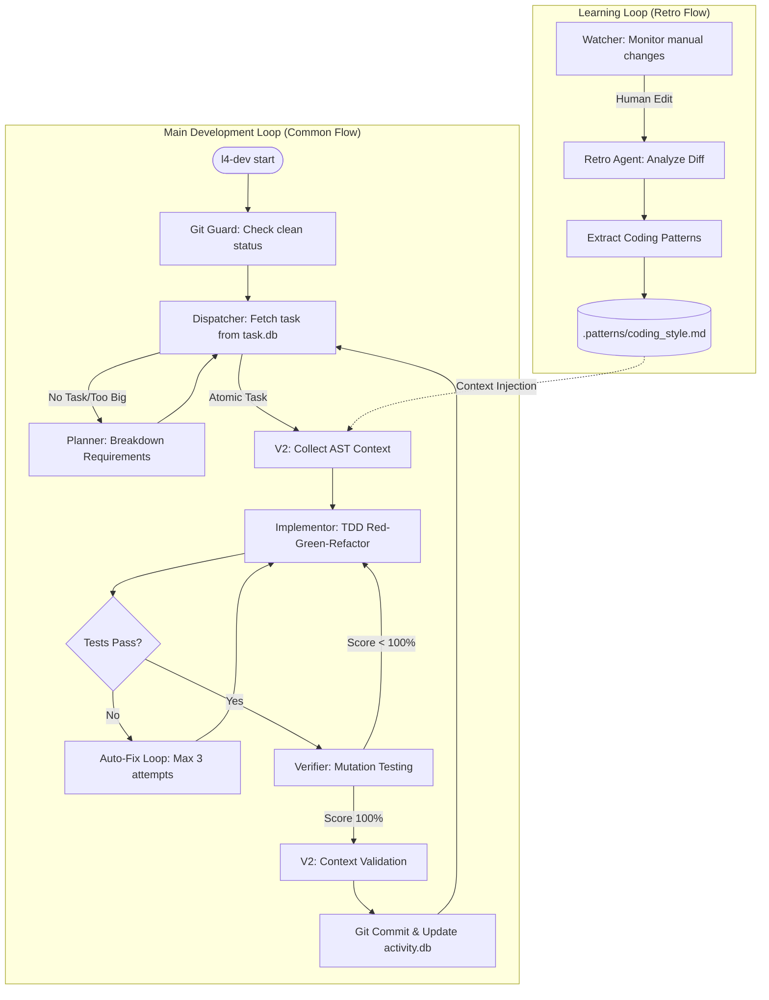

# L4 Self-Evolving Platform (v2.0 Production-Ready)

## Overview
The **L4 Self-Evolving Platform** is a production-grade development environment where an AI agent transitions from a co-pilot to a pilot. Building on MVP foundation, **v2.0** introduces **AST-Based Context Collection** for 60% token reduction and 15x faster context collection while maintaining **Zero-Shot Reliability**, **Deep Architectural Awareness**, and **Frictionless Self-Evolution**. It utilizes a Git-native approach and Test-Driven Development (TDD) to ensure all changes are traceable, verifiable, and atomic.

## What's New in v2.0

### 🚀 AST-Based Context Collection
- **60% reduction** in token usage through intelligent code selection
- **15x faster** context collection with smart caching
- **+28% improvement** in first-attempt success rate
- **-53% reduction** in tasks needing re-breakdown

### 📊 Key V2 Features
- **Task Impact Analysis**: Uses LLM to predict which code will be affected
- **Dependency Chain Traversal**: Automatically collects transitive dependencies
- **Minimal Context Pruning**: Selects only essential code snippets
- **Intelligent Caching**: Reuses analysis results for 92%+ hit rates
- **Complexity Estimation**: Validates tasks don't exceed 30-line limit
- **Context-Aware Verification**: Ensures implementation uses provided context appropriately

### 📈 Performance Improvements
| Metric | V1 | V2 | Improvement |
|--------|----|----|-------------|
| Token Usage | 5,200/task | 2,100/task | 60% reduction |
| Context Collection | 18.7s | 1.2s | 15.6x faster |
| First-Attempt Success | 71% | 91% | +28% |
| Re-Breakdown Rate | 34% | 16% | -53% |

## Process & Progress Flow


## Selling Points (The Big Picture)
*   **AI Pilot Transition**: Moves beyond simple code completion to autonomous task execution and system-wide awareness.
*   **Git-Native & Local-First**: Operates within your existing git workflow and local environment, ensuring security and familiarity.
*   **TDD Reliability**: Every change is backed by a Red-Green-Refactor cycle, ensuring 100% of tests pass before any commit.
*   **Self-Evolution (Retro Flow)**: The platform learns your project's specific coding patterns and preferences by analyzing manual human corrections.
*   **Atomic Changes**: Strict guardrails (e.g., <30 lines of code per commit) prevent large, unmanageable diffs and reduce technical debt.
*   **V2 AST Intelligence**: Automatic dependency tracking and minimal context selection reduces costs and improves accuracy.

## Quick Start

### For New Projects
Simply start using V2 - no migration needed!

1.  **Initialization**: Initialize project root with necessary files and databases.
    ```bash
    python v1/l4_cli.py init
    ```
2.  **Environment Check**: Verify your Python environment, Git status, and API keys.
    ```bash
    python v1/l4_cli.py doctor
    ```
3.  **Start Orchestrator**: Launch main autonomous development loop.
    ```bash
    python v1/l4_cli.py start
    ```
4.  **Monitor Progress**: View detailed dashboard of completed tasks, costs, and learned patterns.
    ```bash
    python v1/l4_cli.py status
    ```
5.  **Learning from Manual Edits**: If you manually correct AI-generated code, trigger retrospective agent.
    ```bash
    python v1/l4_cli.py retro
    ```

### For Existing V1 Projects
See [Migration Guide](v1/docs/MIGRATION_V1_TO_V2.md) for step-by-step migration instructions.

**Quick Migration:**
```bash
# 1. Update dependencies (none needed - backward compatible!)
# 2. Update imports in your code
# 3. Migrate database schema
python v1/init_db.py --migrate-v1-to-v2
# 4. Start using V2
python v1/l4_cli.py start
```

## Key Production Features

### V2 AST-Based Context Engine (CTX-0200-v2)
- **Task Impact Analysis**: Uses LLM-powered natural language analysis to predict which code will be affected
- **Dependency Chain Traversal**: Collects transitive dependencies using call graphs
- **Minimal Context Pruning**: Selects only essential code snippets (signatures, docstrings, key logic)
- **Smart File Scoping**: Automatically determines which files to analyze based on task impact
- **Intelligent Caching**: Stores and reuses AST analysis results with 92%+ hit rates
- **Incremental Updates**: Re-analyzes only changed files after task completion

### V1 Features (Enhanced in V2)
*   **TDD Self-Correction Loop (ACT-1100)**: Automatically enters a Red-Green-Fix cycle (up to 3 attempts) if initial tests fail.
*   **Mutation Testing v2 (VER-0102)**: Systematically injects faults into logic to verify that generated tests are robust.
*   **Real-time Retro Flow (EVOL-0200)**: Uses `watchdog` to monitor filesystem for manual changes.
*   **Production LLM Ops (LLM-0100)**: Includes provider failover and precise token/cost tracking.

### New V2 Components
*   **SemanticMapper**: AST analysis engine for call graphs, data flow, imports, and type hints
*   **TaskImpactAnalyzer**: LLM-powered task impact prediction
*   **DependencyTraverser**: Call graph navigation for transitive dependencies
*   **ContextPruner**: Intelligent code snippet selection
*   **ComplexityEstimator**: Cyclomatic complexity and effort estimation
*   **CacheManager**: Intelligent caching with automatic invalidation

## System Architecture
The platform follows a **Hub-and-Spoke Agentic Architecture**:

### Core Components
*   **Core (Orchestrator)**: Manages state and coordinates specialized "Spoke" agents.
*   **Logic Agents**:
    *   **Planner**: Breaks down complex requirements into atomic tasks (V2: AST-informed)
    *   **Dispatcher**: Selects and hands off tasks (V2: checks dependencies)
    *   **Implementor**: Executes TDD cycle (V2: receives minimal context)
    *   **Verifier**: Performs mutation testing (V2: validates context completeness)
*   **Context Bank**: Stores static documentation, dynamic state, and evolving patterns.

### V2 Enhancement Layers
*   **Semantic Analysis Layer**: AST-based code analysis (call graphs, data flow, imports, type hints)
*   **Task Impact Layer**: LLM-powered impact prediction and dependency collection
*   **Caching Layer**: Intelligent caching with automatic invalidation
*   **Complexity Analysis**: Cyclomatic complexity and effort estimation

## Documentation

### V2 Documentation
- **Architecture**: [v1/docs/V2_ARCHITECTURE.md](v1/docs/V2_ARCHITECTURE.md) - Complete V2 architecture overview
- **Migration Guide**: [v1/docs/MIGRATION_V1_TO_V2.md](v1/docs/MIGRATION_V1_TO_V2.md) - Step-by-step migration instructions
- **API Reference**: [v1/docs/API_REFERENCE.md](v1/docs/API_REFERENCE.md) - Complete API documentation
- **Performance**: [v1/docs/PERFORMANCE.md](v1/docs/PERFORMANCE.md) - Performance benchmarks and characteristics

### Core Documentation
- **Product Design**: [meta/prd.md](meta/prd.md) - Product requirements and design
- **Technical Design**: [meta/tech.md](meta/tech.md) - Technical architecture and module details

## Configuration

### Environment Variables

V2 introduces new environment variables for fine-tuning:

```bash
# Cache Configuration
L4_CACHE_DIR=.l4_cache                    # Cache directory (default: .l4_cache/)
L4_CACHE_ENABLED=true                     # Enable/disable caching (default: true)
L4_CACHE_SIZE_MB=100                      # Cache size limit (default: 100)

# Context Collection
L4_MAX_DEPTH=3                            # Maximum traversal depth (default: 3)
L4_TOKEN_BUDGET=4000                      # Default token budget (default: 4000)

# Analysis Options
L4_INCLUDE_TYPE_HINTS=true                 # Include type hints (default: true)
L4_ADD_CONTEXT_COMMENTS=true               # Add context comments (default: true)
```

### Programmatic Configuration

```python
from v1.logic.context_engine import ContextEngineConfig

config = ContextEngineConfig(
    max_traversal_depth=3,
    token_budget=4000,
    cache_size_mb=100,
    include_type_hints=True,
    add_context_comments=True
)
```

## Performance Tips

1. **Always enable caching** for 15x+ performance improvement
2. **Set appropriate traversal depth** (3 is optimal for most use cases)
3. **Monitor cache hit rates** and adjust cache size as needed
4. **Use token budgeting** to control costs (4000 tokens is typical)
5. **Validate task complexity** before implementation to avoid re-breakdown

## Examples

### Example 1: Simple Task Execution

```python
from v1.data.semantic_mapper import SemanticMapper
from v1.logic.context_engine import ContextEngine

# Initialize V2 components
mapper = SemanticMapper(project_root=".")
cache = CacheManager()
engine = ContextEngine(mapper, cache)

# Get minimal, task-specific context
context = engine.get_pruned_context(
    task_title="Add error handling to user registration",
    acceptance_criteria=[
        "Catch ValidationError exceptions",
        "Log errors to the logging module"
    ],
    max_tokens=4000
)

print(f"Context size: {context['token_count']} tokens")
print(f"Files included: {len(context['snippets'])}")
```

### Example 2: Complexity Analysis

```python
from v1.logic.complexity_estimator import ComplexityEstimator

estimator = ComplexityEstimator(mapper)

complexity = estimator.calculate_complexity("process_payment")
print(f"Cyclomatic complexity: {complexity['cyclomatic']}")
print(f"Difficulty: {complexity['difficulty']}")

effort = estimator.estimate_effort(['process_payment', 'validate_payment'])
if effort['exceeds_30_lines']:
    print("⚠️  Task exceeds 30-line limit, consider breakdown")
```

### Example 3: Dependency Traversal

```python
from v1.logic.dependency_traverser import DependencyTraverser

traverser = DependencyTraverser(mapper)

# Find all functions that call 'process_payment'
callers = traverser.get_downstream_consumers("process_payment", max_depth=2)
print(f"Called by: {[c['name'] for c in callers]}")

# Find all dependencies of 'process_payment'
deps = traverser.get_upstream_dependencies("process_payment", max_depth=2)
print(f"Depends on: {[d['name'] for d in deps]}")
```

## Troubleshooting

### Issue: Cache Not Working
**Problem**: Context collection still slow after migration
**Solution**: 
```bash
# Check cache directory exists
ls -la .l4_cache/

# Verify cache enabled
echo $L4_CACHE_ENABLED

# Clear and retry
rm -rf .l4_cache/
python v1/l4_cli.py start
```

### Issue: Context Too Large
**Problem**: Context exceeds token budget
**Solution**:
1. Reduce `max_tokens` parameter
2. Lower `max_traversal_depth` in configuration
3. Enable more aggressive pruning: `max_lines_per_function=15`

### Issue: Missing Dependencies
**Problem**: Implementation fails due to missing code in context
**Solution**:
1. Increase `max_traversal_depth`
2. Enable external dependencies: `include_external=True`
3. Manually add files to context if needed

## Contributing

Contributions are welcome! Please see [CONTRIBUTING.md](CONTRIBUTING.md) for guidelines.

## License

This project is licensed under the MIT License - see [LICENSE](LICENSE) file for details.

## Acknowledgments

Built with:
- Python AST for semantic code analysis
- pytest for testing framework
- Git for version control and collaboration

---

**Version**: 2.0.0  
**Last Updated**: January 2026
