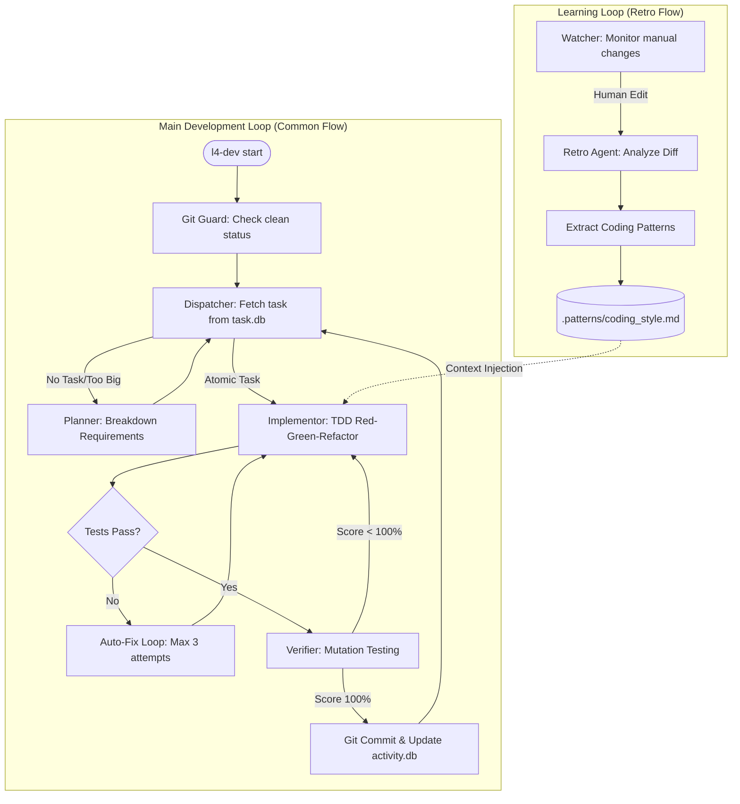

# L4 Self-Evolving Platform (v1.0 Production-Ready)

## Overview
The **L4 Self-Evolving Platform** is a production-grade development environment where an AI agent transitions from a co-pilot to a pilot. Building on the MVP foundation, v1.0 focuses on **Zero-Shot Reliability**, **Deep Architectural Awareness**, and **Frictionless Self-Evolution**. It utilizes a Git-native approach and Test-Driven Development (TDD) to ensure all changes are traceable, verifiable, and atomic.

## Process & Progress Flow


## Selling Points (The Big Picture)
*   **AI Pilot Transition**: Moves beyond simple code completion to autonomous task execution and system-wide awareness.
*   **Git-Native & Local-First**: Operates within your existing git workflow and local environment, ensuring security and familiarity.
*   **TDD Reliability**: Every change is backed by a Red-Green-Refactor cycle, ensuring 100% of tests pass before any commit.
*   **Self-Evolution (Retro Flow)**: The platform learns your project's specific coding patterns and preferences by analyzing manual human corrections.
*   **Atomic Changes**: Strict guardrails (e.g., <30 lines of code per commit) prevent large, unmanageable diffs and reduce technical debt.

## Quick Start
To get started with the production environment, ensure you are in the project root and your environment is set up.

1.  **Initialization**: Initialize the project root with the necessary files and databases.
    ```bash
    python v1/l4_cli.py init
    ```
2.  **Environment Check**: Verify your Python environment, Git status, and API keys.
    ```bash
    python v1/l4_cli.py doctor
    ```
3.  **Start the Orchestrator**: Launch the main autonomous development loop.
    ```bash
    python v1/l4_cli.py start
    ```
4.  **Monitor Progress**: View a detailed dashboard of completed tasks, costs, and learned patterns.
    ```bash
    python v1/l4_cli.py status
    ```
5.  **Learning from Manual Edits**: If you manually correct AI-generated code, trigger the retrospective agent to learn the new pattern.
    ```bash
    python v1/l4_cli.py retro
    ```

## Key Production Features
*   **Deep Context Engine (CTX-0200)**: Uses Python AST for semantic mapping of classes and dependencies, injecting only the most relevant code into the LLM context.
*   **TDD Self-Correction Loop (ACT-1100)**: Automatically enters a Red-Green-Fix cycle (up to 3 attempts) if initial tests fail, using error logs to generate fixes.
*   **Mutation Testing v2 (VER-0102)**: Systematically injects faults into logic to verify that generated tests are robust and actually catch regressions.
*   **Real-time Retro Flow (EVOL-0200)**: Uses `watchdog` to monitor the filesystem for manual changes, enabling instant pattern extraction and update to `.patterns/`.
*   **Production LLM Ops (LLM-0100)**: Includes provider failover (Gemini/Claude/GPT-4) and precise token/cost tracking in `activity.db`.

## System Architecture
The platform follows a **Hub-and-Spoke Agentic Architecture**:
*   **Core (Orchestrator)**: Manages state and coordinates specialized "Spoke" agents.
*   **Logic Agents**:
    *   **Planner**: Breaks down complex requirements into atomic tasks.
    *   **Dispatcher**: Selects and hands off tasks.
    *   **Implementor**: Executes the TDD cycle.
    *   **Verifier**: Performs mutation testing and final validation.
*   **Context Bank**: Stores static documentation (`product.md`, `technical.md`), dynamic state (`task.db`, `activity.db`), and evolving patterns (`.patterns/`).

---
*For more details, refer to `v1/design.md` for production specs, `product.md` for business logic, and `technical.md` for architectural deep-dives.*
